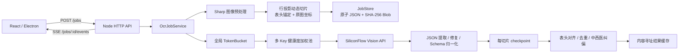

# aiauto OCR 后端

## 运行方式

```powershell
$env:SILICONFLOW_API_KEYS = "key-a,key-b"
npm run start:backend
```

服务默认监听 `127.0.0.1:8787`，数据写入 `.aiauto-data/`。任务 JSON、原图和切片均落盘，API Key 只存在进程内，不写入任务文件。

## 架构



### 模块职责

- `smartSlicing.ts`：缩放、灰度化、CLAHE（局部对比度增强）、中值去噪；依据水平投影寻找表头和安全切点，返回每片原图坐标。
- `rateLimiter.ts`：全局令牌桶、按 Key 的健康度、并发数、冷却时间和带抖动指数退避。
- `siliconFlowClient.ts`：对 408、429、500、502、503、504 透明重试，并解析 `Retry-After`。
- `json.ts`：提取模型 JSON、修复截断对象/数组/尾逗号，并将不可信响应收敛到明确的结构。
- `normalizer.ts`：ICD-10 清洗、中医病名/证型分流、初复急诊状态归位、日期标准化和省略号统一。
- `jobStore.ts`：任务状态机、原子持久化、SHA-256 内容寻址 Blob 和结果缓存。
- `jobService.ts`：切片、识别、checkpoint、合并和缓存的编排；进程异常后只重跑未完成切片。
- `httpServer.ts`：批量上传、状态查询和 SSE 进度流。

## HTTP 接口

### 创建批量任务

`POST /jobs`

```json
{
  "images": [{ "name": "住院记录.png", "dataUrl": "data:image/png;base64,..." }],
  "model": "Qwen/Qwen3-VL-8B-Instruct",
  "concurrency": 4,
  "apiKeys": "可选；生产环境建议使用 SILICONFLOW_API_KEYS"
}
```

响应为 `202`，返回每张图片对应的任务 ID。随后查询 `GET /jobs/:id`，或订阅 `GET /jobs/:id/events`。SSE 事件包含已完成切片数、百分比、耗时和 ETA（预计剩余时间）。

## 生产部署建议

1. API Key 通过密钥管理服务或环境变量注入，禁止由浏览器长期保存并上传到服务端日志。
2. 单进程文件存储适合 Electron/单机部署；多实例部署时将 `JobStore` 替换为 PostgreSQL/SQLite + 对象存储，并用 BullMQ 或 Redis Streams 承载队列。
3. 对 `/jobs` 增加认证、租户隔离、图片 MIME/像素/压缩炸弹限制和审计日志；当前实现已限制请求体 50 MB，并校验 Blob hash。
4. 生产环境将 SSE 放在反向代理时关闭缓冲，并设置空闲心跳；大型批量任务应把 `images` 拆成多个请求，避免单请求过大。
5. 对模型空结果设置人工复核队列；不能把“无法确认”自动补全为医学事实。

## 验证

```powershell
npm run test:backend
npm test
```
